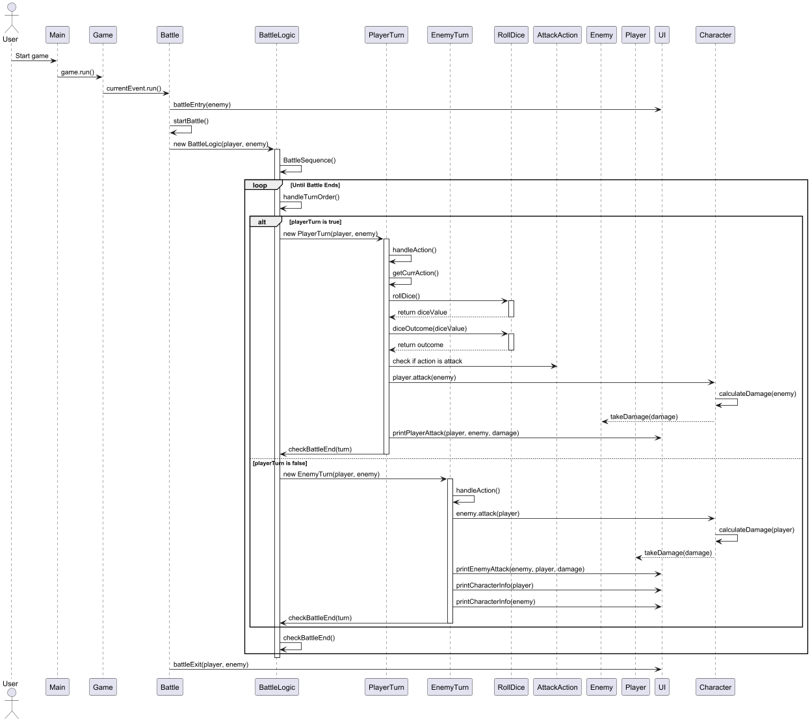
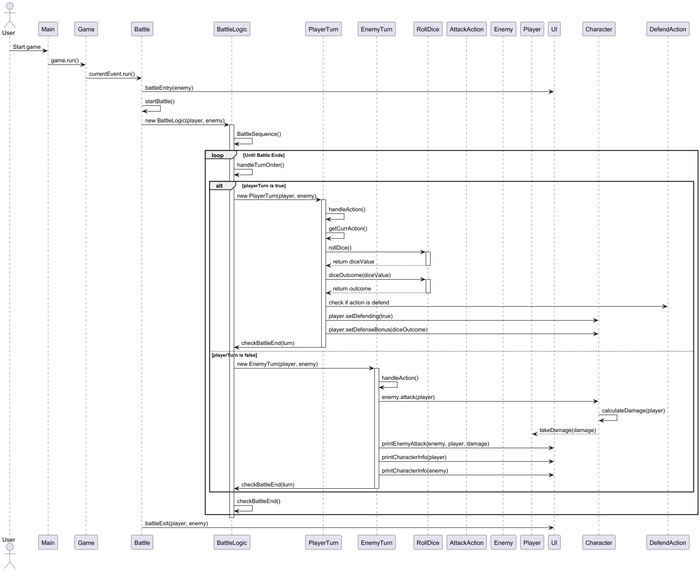

# Rolladie Developer Guide   
***


## Acknowledgement
***

{list here sources of all reused/adapted ideas, code, documentation, and third-party libraries -- include links to the original source as well}

## Design & implementation
***

{Describe the design and implementation of the product. Use UML diagrams and short code snippets where applicable.}
### Class Structure
```
+---main
|   \---java
|       +---Exceptions
|       |       RolladieException.java
|       |       
|       +---Functionalities
|       |       Parser.java
|       |       Storage.java
|       |       UI.java
|       |       
|       +---Game
|       |   |   Game.java
|       |   |   Rolladie.java
|       |   |   RollDice.java
|       |   |   
|       |   +---Actions
|       |   |   |   Action.java
|       |   |   |   DefaultAction.java
|       |   |   |   ExitAction.java
|       |   |   |   HelpAction.java
|       |   |   |   StartAction.java
|       |   |   |   
|       |   |   \---BattleAction
|       |   |           AttackAction.java
|       |   |           BattleAction.java
|       |   |           DefendAction.java
|       |   |           FleeAction.java
|       |   |           
|       |   +---Characters
|       |   |       Character.java
|       |   |       Enemy.java
|       |   |       EnemyDatabase.java
|       |   |       Player.java
|       |   |       
|       |   +---Currency
|       |   |       Gold.java
|       |   |       
|       |   +---Equipment
|       |   |       Armor.java
|       |   |       ArmorDatabase.java
|       |   |       Boots.java
|       |   |       Equipment.java
|       |   |       EquipmentList.java
|       |   |       Weapon.java
|       |   |       
|       |   \---Events
|       |       |   Event.java
|       |       |   EventType.java
|       |       |   
|       |       \---Battle
|       |               Battle.java
|       |               BattleLogic.java
|       |               EnemyTurn.java
|       |               PlayerTurn.java
|       |               Turn.java
|       |               
|       \---seedu

```

### Class Diagram
miro board ???

## Key Features
***
### 1. Attack
The sequence diagram below illustrates the process that occurs when the player inputs an attack command.



### 2. Defend
The sequence diagram below illustrates the process that occurs when the player inputs an defend command.




### 3. Exit ?

### 4. Load ?

### 5. Start ?


## Product scope
***
### Target user profile

RollaDie is designed for CS2113 students who want a fun and simple way to relax, 
and to enjoy the easy-to-use text-based interface and clear game rules.
The game is also great for DnD fans who like turn-based battles, strategy, and storytelling,
without the hassle of setting up a full game.

### Value proposition

RollaDie is a fun and nostalgic text-based RPG that brings the adventurous spirit of Dungeon & Dragons (DnD)
to life in a simple way.  It brings the excitement of classic role-playing games to a simple 
Command Line Interface (CLI), making it lightweight and easy to play anytime, anywhere.
Instead of dealing with complicated setups, players can jump straight into the action,
rolling dice, battling enemies, and making crucial choices.

## User Stories
***

| Version | As a ...        | I want to ...                                         | So that I can ...                   |
|---------|-----------------|-------------------------------------------------------|-------------------------------------|
| v1.0    | student player  | attack during the battle phase                        | deal damage to enemy.               | 
| v1.0    | student player  | defend during the battle phase                        | reduce the damage taken.            |
| v1.0    | student player  | fight enemies                                         | collect points for a final score.   |
| v1.0    | student player  | input simple commands ( attack, defend )              | get used to the controls.           |
| v1.0    | student player  | see my health bar                                     | better decide my next move.         |
| v2.0    | student player  | save game progress                                    | continue my game.                   |
| v2.0    | student player  | roll dice                                             | determine the outcome of an action. |
| v2.0    | student player  | fight different enemies with different battle effects | make the journey more dynamic.      |
| v2.0    | student player  | change my equipment                                   | determine the outcome of an action. |
| v2.0    | student player  | collect points                                        | upgrade my equipment.               |

## Non-Functional Requirements

{Give non-functional requirements}


## Testing
***
### Structure
Tests are organized according to the package structure:

```
  \---java
    +---Game
    |   |   RolladieTest.java
    |   |   RollDiceTest.java
    |   |   
    |   +---Battle
    |   |       BattleTest.java
    |   |       
    |   \---Characters
    |           CharacterTest.java
    |           
    \---seedu
        \---duke

```
{Give instructions on how to do a manual product testing e.g., how to load sample data to be used for testing}


## Glossary

* *glossary item* - Definition
