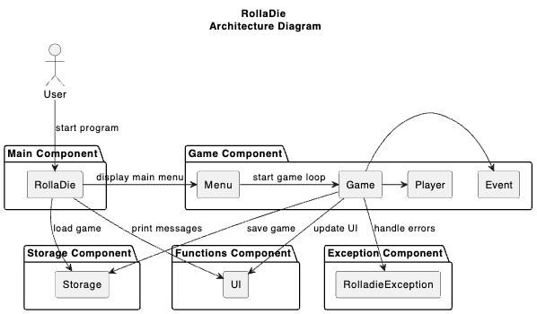
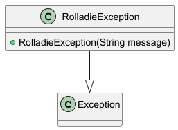
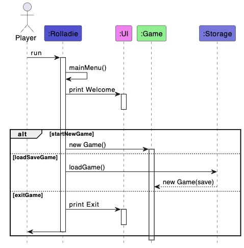
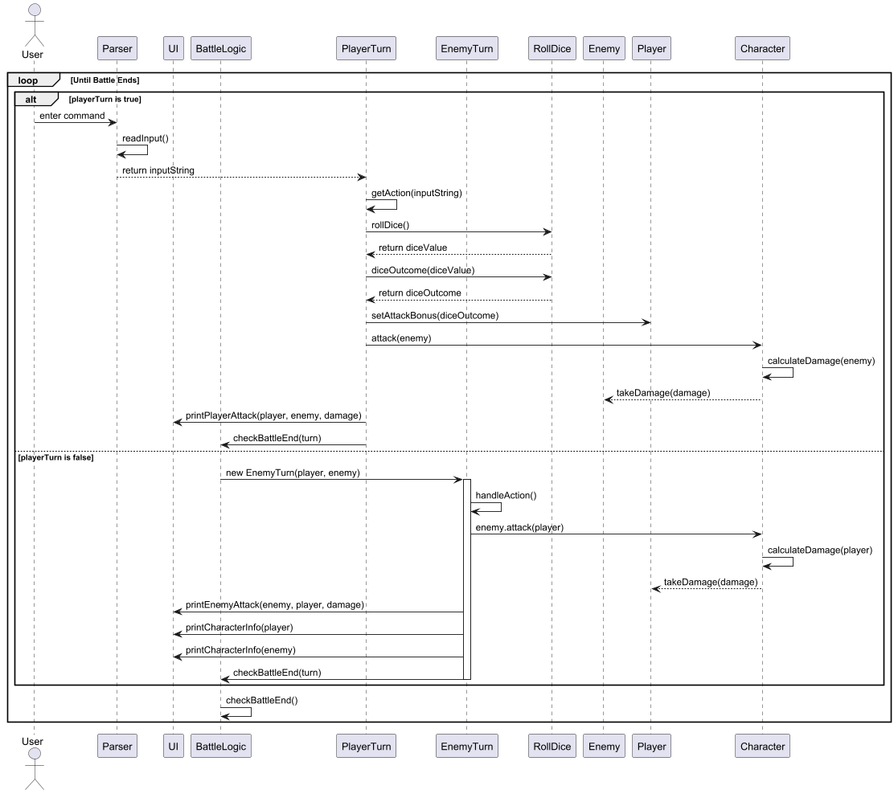
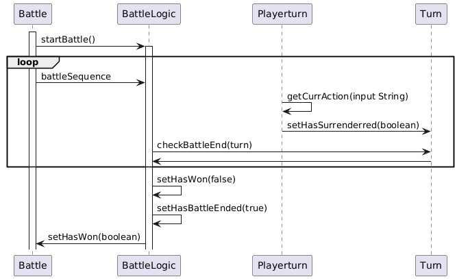
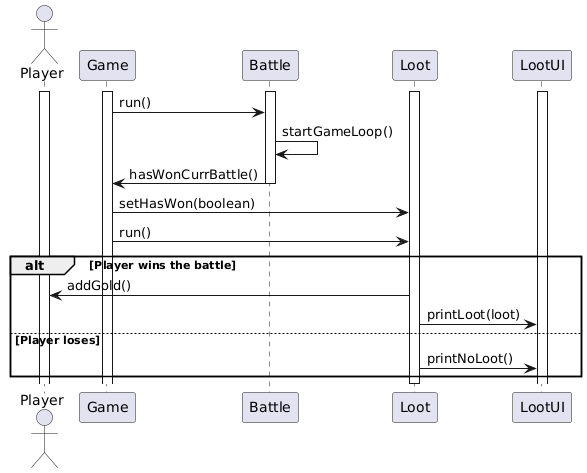
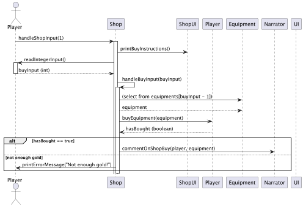
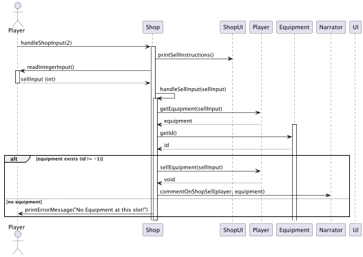

# RollaDie Developer Guide  

## Acknowledgement
This project was made possible with the help of the listed tools below:
- Junit (Provides a robust testing framework)
- Gradle (Simplifying dependency management and automating the build process)

## Setting Up and Getting Started    

Follow these steps to set up and run the Game on your local machine.      

### Prerequisites 
Ensure you have the following installed:
- Intellij IDEA (highly recommended), or any other IDE
- Java 17 (Required to run the application)
- Gradle (Used for dependency management and building the project)

### Step 1: Fork and Clone the Repository       
1. **Fork** the repository to your GitHub account.
2. **Clone** the forked repository to your local machine using:
```
git clone https://github.com/AY2425S2-CS2113-T13-4/tp.git
```

### Step 2: Import the Project into IntelliJ IDEA
1. Open IntelliJ IDEA.
2. Click File > Open and select the cloned project folder.
3. When prompted, import the project as a Gradle project.
4. Wait for the dependencies to be downloaded.


## Design

## Architecture 
        

The Architecture diagram given above explain the high-level design of the application.      


### Class Structure

```
    +--- characters
    |   └── abilities
    |   |   ├── Ability.java
    |   |   ├── AbilityType.java
    |   |   ├── BasicAttack.java
    |   |   ├── Crush.java
    |   |   ├── Flee.java
    |   |   ├── Heal.java
    |   |   ├── PowerStrike.java
    |   |   └── Whirlwind.java
    |   └── players
    |       ├── Aria.java
    |       ├── Blaze.java
    |       └── Player.java
    +--- equipment
    |   ├── Armor.java
    |   ├── ArmorDatabase.java
    |   ├── Boots.java
    |   ├── BootsDatabase.java
    |   ├── DragonShield.java
    |   ├── EmptySlot.java
    |   ├── Equipment.java
    |   ├── EquipmentList.java
    |   ├── FlamingSword.java
    |   ├── IronChainmail.java
    |   ├── ThunderAxe.java
    |   ├── Weapon.java
    |   └── WeaponDatabase.java
    +--- events
    |   ├── Battle.java
    |   ├── Event.java
    |   ├── Loot.java
    |   └── Shop.java
    +--- functions
    |   ├── DiceBattleAnimation.java
    |   ├── Pair.java
    |   ├── Storage.java
    |   ├── TerminalClear.java
    |   ├── TypewriterEffect.java
    |   └── UI.java
    +--- game
    |   └── Game.java
    +--- Rolladie.java
    +--- ui
    |   ├── AnsiColor.java
    |   ├── BattleDisplay.java
    |   ├── HpBar.java
    |   ├── LootUI.java
    |   ├── Narrator.java
    |   └── ShopUI.java
    └── exceptions
        └── RolladieException.java
```

## Component Details

### 1. Main component
`RollaDie` class is the starting point of the program. It will call the mainMenu() method which displays a list of choices to the player, namely, starting a new game, loading from a previous save, and to exit from the game completely.

The main menu is also displayed when the player is defeated and ends a game. This allows for convenient game continuation.

The bulk of the app’s work is done by the following components:
- `Functions`: Encapsulates all printing methods and terminal animations.
- `Game`: Gameplay mechanics and loop logic.
- `Storage`: Manages saving and loading data to and from the hard disk.
- `Exception`: Handle Exceptions during runtime.

### 2. Functions component     

The `UI` class manages all the console prints including the ASCII characters and model representations. When an animation is required, it directs the call to the respective packages that hold the methods, such as `DiceBattleAnimation`, `TypewriterEffect` and `HpBar`, to invoke the correct animation sequence to play for the player.

It also encompasses the methods to read inputs from the player.

The following are all the essential methods used for UI display within the game.

#### BattleDisplay pkg
`showPlayerStatus(Player)` - draw Player stats at the start of each round.
#### HpBar
`animate(Player1, Player2, prevHP1, prevHP2, diceDisplay)` - animate the HP bar to show the changes in HP visually, with colours representing the HP status.
#### DiceBattleAnimation pkg
`animateBattle(int[] player1rolls, int[]player2rolls` - draw dice rolling animation for both players, side-by-side. Vary the number of dice by passing different sized integer arrays into the method.
#### TypewriterEffect pkg
`print(text)` or `print(text, withDelayAfterwards)` - prints the text character by character, with a longer pause at commas and full stops.
#### TerminalClear pkg
`clearAndWrite(contentToWriteAfterClearingScreen)` - simplifies the clear screen method and reduces stuttering or flickering observed on Windows terminals.
#### Narrator
`commentOnHealth(Player)` - Narrate the amount of Hit Points a certain player has remaining.
`commentOnMomentum(Player1, Player2, damageDealt, p2PrevHp)` - Spot the dynamics changing within the battle and announce to boost or quash Player morale.

### 3. Game component       
The game component stores the main game logic. The game runs in two loops, one external loop managing the waves of enemy encounters, and another responsible for the battle sequence.

The waves indicate the number of enemies the player has faced from the beginning of the game. Rounds show the number of bouts that the player has made against the current enemy.

When the player faces against an enemy, the `StartBattle()` method is called. This puts the game inside a loop until either character falls. The outcome of the battle determines if the player proceeds to the next encounter.

`StartBattle(Player1, Player2)` - begin battle sequence for a wave

### 4. Storage component

The Storage Component is responsible for saving and loading Game progress.

It reads and writes Game data to a text file (savefile.txt), ensuring that players can resume their Game after closing the application.         

The Storage class provides the following functionalities:

1. Save the Game:

- The `saveGame(Player, Event, Queue<Event>)` method writes player stats, the current event,
and upcoming events to a file.
- It converts Game objects into a text format using their `toText()` methods.

2. Load the Game:

- The `loadGame()` method reads the save file and reconstructs the Game state.
- It calls helper methods `parseCharacterFromText()` and `parseEventFromText()` to convert text data back into objects.
- If the save file is missing or corrupted, it creates a new Game instance instead.

3. Data Parsing:

- `parseCharacterFromText()` deciphers character stats (health, attack, defense, etc.) from text.
- `parseEventFromText()` reconstructs different Game events, such as battles, from saved data.


### 5. Exception component
- Exceptions: The program throws `RolladieException` when encountering errors, and prints a custom message to the terminal with more details.



  
## Implementation
## Key Features

### 1. Save and Load
**Overview**    
The Save and Load feature in Rolladie is an important part of the game as it allows players to not lose
their progress in the game. When the player starts the game, he/she is brought to the main menu, which allows them to select between Start Game, Load Game and Exit.

If a player chooses to start the game, they automatically start a new game. If the player chooses to load game, they will be able to choose a save slot to load from.

**Implementation Details**     
The Save and Load feature in RollaDie handles the storage of all player information and battle information.
1. The process begins with the player booting up the game.
2. The player will be greeted by the main menu, allowing the player to choose from 1-3, where 1 is
Start Game, 2 is Load Game and 3 is exit game.
3. If player chooses 1, a new Game object is created where player starts a new game.
4. If player chooses 2, `loadGame()` in the Storage class will be called to fetch the serialised data, which
is processed to load the game information, and initialise a new Game object based on the data fetched.
5. If player chooses 3, the game exits itself.
6. After every loot and shop event, the game also presents the users with an opportunity to save the game.
7. If the player selects "y", the game prompts the user to choose from 1-3 to save to a save slot, else 
if player selects "n", game does not save.

**Sequence Diagram**         
     
The sequence diagram below illustrates the process that occurs when the game boots and prompts user to load.



### 2. Attack       
**Overview**    
        
The Attack Feature in RollaDie is a core component of the Game's battle system, allowing the player and enemy to take turns attacking each other. The feature manages input handling, attack calculations, and battle progression.
- During the player's turn, the Game reads the player's command, determines the action, cooldown, power, and roll dice to calculate attack bonuses. 
If the player chooses to attack, the attack is executed, and damage is applied to the enemy. The Game then prints the attack message and checks if the battle has ended.      
- The player can choose from the numbers provided on screen to choose different attacks during his turn.
- During the enemy's turn, the enemy follows a similar process which is attacking the player, applying damage, and displaying attack messages. The Game continues alternating between player and enemy turns until either the player or the enemy is defeated. This feature ensures smooth battle flow, handles attack mechanics, and updates battle status dynamically, keeping the combat engaging and strategic.


**Implementation Details**     
        
The Attack Feature in RollaDie handles the player's and enemy's turn-based combat interactions. 
1. The process begins with the player's turn, where the user enters a command, which is read and parsed by the player class.  
2. The parsed command is processed by Player, which sets chosen ability based on the command parsed.       
3. If the player's attack requires power, deduct the required power. If power is insufficient, return invalid attack.
4. The player’s attack chosen will start its cooldown is sent to the **Battle** class where the attack will be stored as the player's ability chosen. The enemy will then choose ability based on `chooseAIAction()` method in Player class.
5. Both player and enemy will then roll dices to determine the damage that they do based on the formula: damage =
`[(dice roll result) + (num of dice) * (weapon bonus) - (opponent armor defense)] * [(power) / (max power) * 0.5 * (ability damage multiplier)]`
5. Both the player and enemy will then carry out their move and attack each other, deducting both characters' health based on damage formula.
6. Cooldown of all abilities decreases by 1.
7. This loop repeats until the battle ends.

**Sequence Diagram**         
     
The sequence diagram below illustrates the process that occurs when the player inputs an attack command.



### 3. Heal        
**Overview**

The heal Feature in RollaDie allows players to adopt a heal during their turn instead of attacking.
This feature enhances strategic gameplay by giving the player an option to heal and recover both
health and power which is needed for casting skills.The battle sequence continues until either 
the player or the enemy is defeated.

**Implementation Details**   
The implementation is generally very similar to the attack feature above, with the only difference being the action used.

During the player’s turn:
1. The user inputs command "2", which is the heal action.
2. The parsed command is processed by Player, which sets chosen heal ability based on the command parsed.      
3. The heal action will start its cooldown and is sent to the **Battle** class where the heal action
is stored as the player's ability chosen. The enemy will also choose an ability.
4. Only the enemy rolls a die and the player will be healed for a flat amount of health. The enemy will deal damage
based on die roll while the player will heal a fixed amount.

**Sequence Diagram**        

The sequence diagram is shared with the attack feature above.


### 4. Flee        
**Overview**      
The flee feature in Rolladie is to allow the player to escape from nasty situations.
This feature allows players to make a strategic retreat to re gear up before fighting strong enemies.
When the player chooses to flee, the battle ends immediately and the player goes onto the next event.

**Implementation Details**          
1. During the player's turn, **PlayerTurn** class gets the current action of player.
2. If player chooses to flee, **PlayerTurn** sets hasSurrendered in **Turn** to true.
3. **BattleLogic** checks if hasSurrendered in **Turn** is true and sets hasWon to false and hasBattleEnded to true.
4. **BattleLogic** returns hasWon = false to **Battle** class to end the battle.

**Sequence Diagram**          



### 5. Loot      
**Overview**
The loot feature in Rolladie allows the player to get gold after winning a battle.
This feature enables players to earn gold to upgrade himself in the shop.
If player does not win battle, he does not get gold.

**Implementation Details**
1. After the battle, **Battle** object will send hasWon to **Game** to set the hasWonCurrBattle in Game to true
or false depending on whether the player won or fled from the battle.
2. **Game** sets the hasWon variable in **Loot** based on hasWonCurrBattle.
3. If hasWon in **loot** is true, add gold to player and print the loot that the player got.
4. If hasWon in **loot** is false, print that the player got no loot.

**Sequence Diagram**



### 6. Buy
**Overview**
The buy feature in Rolladie allows the player to equip themselves with stronger equipment by spending their gold.
This feature enables players to be strong enough to put up a fight with the stronger enemies as the wave number progresses.
The player cannot buy equipment that is too expensive.
Buying an Equipment type that the player already has will automatically remove it and replace it with the bought equipment. 
Player will not gain gold when equipment is removed this way.

**Implementation Details**
1. After every even-numbered enemy encounter, the player will be sent to **Shop**.
2. The main shop screen will display the player's gold amount, a list of **Equipment** and its details for the user to buy, each marked with an index, and a list of commands to select.
3. If the player want to buy an equipment, they will input 1 to select [1. Buy].
4. The shop will then print instructions on how to buy the desired equipment, that is, enter the index of it.
5. If the player has enough gold, the player will equip the current equipment, and the value of the equipment will be deducted from the gold of the player.
6. Any existing equipment of the same type as the bought equipment will be automatically removed, but the player do not gain gold from such a removal.
7. The **Player** toString() method will be called to show the new stats and equipment of the player, then return to the main shop screen.
8. If the player does not have enough gold, the game will only print "not enough gold" and return to the main shop screen.
9. In the main shop screen, they can input 3 to select [3. Exit the Shop] to exit the Shop.

**Sequence Diagram**


### 7. Sell
**Overview**
The sell feature in Rolladie allows the player to sell old equipment to earn gold, so that they can better afford higher-end equipment in the shop.
This feature enables players to have an additional way to gain gold, as well as remove equipment they no longer want..
The player cannot sell equipment types they do not have.

**Implementation Details**
1. After every even-numbered enemy encounter, the player will be sent to **Shop**.
2. The main shop screen will display the player's gold amount, a list of **Equipment** and its details for the user to buy, each marked with an index, and a list of commands to select.
3. If the player want to buy an equipment, they will input 1 to select [2.Sell].
4. The shop will then print instructions on how to sell the desired equipment and the index for the three types of equipment.
5. If the Player does not own the Equipment type selected, an error message will be printed and the player will return to the main shop screen.
6. If the Player owns the Equipment type selected, an amount of gold equal to equipment.getValue() will be earned by the Player, and the equipment will be removed.
7. The **Player** toString() method will be called to show the new stats and equipment of the player, then return to the main shop screen.
8. In the main shop screen, they can input 3 to select [3. Exit the Shop] to exit the Shop.

**Sequence Diagram**



## Appendix

## Product scope

### Target user profile:

RollaDie is designed for CS2113 students who want a fun and simple way to relax, and to enjoy the easy-to-use text-based interface and clear Game rules.
The Game is also great for DnD fans who like turn-based battles, strategy, and storytelling, without the hassle of setting up a full Game.

### Value proposition:

RollaDie is a fun and nostalgic text-based RPG that brings the adventurous spirit of Dungeon & Dragons (DnD) to life in a simple way.  It brings the excitement of classic role-playing games to a simple Command Line Interface (CLI), making it lightweight and easy to play anytime, anywhere.
Instead of dealing with complicated setups, players can jump straight into the action, rolling dice, battling enemies, and making crucial choices.

## User Stories
***

| Version | As a ...        | I want to ...                                         | So that I can ...                   |
|---------|-----------------|-------------------------------------------------------|-------------------------------------|
| v1.0    | student player  | attack during the battle phase                        | deal damage to enemy.               | 
| v1.0    | student player  | heal during the battle phase                          | reduce the damage taken.        |
| v1.0    | student player  | fight enemies                                         | collect points for a final score.  |
| v1.0    | student player  | input simple commands ( attack, defend )              | get quickly used to the controls. |
| v1.0    | student player  | see my health bar                                     | better decide my next move.         |
| v2.0    | student player  | save Game progress                                    | continue my Game.                   |
| v2.0    | student player  | roll dice                                             | determine the outcome of an action. |
| v2.0    | student player  | fight different enemies with different battle effects | make the journey more dynamic.      |
| v2.0    | student player  | change my equipment                                   | determine the outcome of an action. |
| v2.0    | student player  | collect currency                                      | upgrade my equipment.               |

## Non-Functional Requirements
1. Should work on any mainstream OS as long as it has Java 17 or above installed.
2. This Game is designed as a single-player experience.
3. This Game is optimized for users with an average typing speed.


## Testing        
### Manual testing
#### Create a new player character
Steps:
Start the program
Create a new game
Enter your chosen name
Save the progress
Exit to main menu and load the save file
Verify that the created user retains its name and stats

#### Storage verification
Steps:
Fully quit the program (close it via the `exit` command or by selecting exit on the main menu)
Reopen the program and load the save file. The program should seamlessly load your previously saved progress.

### Structure
Tests are organized according to the package structure:

```
+---data
|   \---StorageTest
|           ValidData.txt
|           
\---java
+---Game
|   |   GameTest.java
|   |   RolladieTest.java
|   |   RollDiceTest.java
|   |   
|   +---Battle
|   |       BattleTest.java
|   |       
|   +---Characters
|   |       CharacterTest.java
|   |       
|   \---Functionalities
|           UITest.java
|           
\---seedu
\---duke

```


## Glossary
* *User* - A person who plays the Game.
* *Mainstream OS* -  Windows, Linux, Unix, MacOS
* *Wave* - The number of enemy encounters
* *Round* - The bout number of the current battle