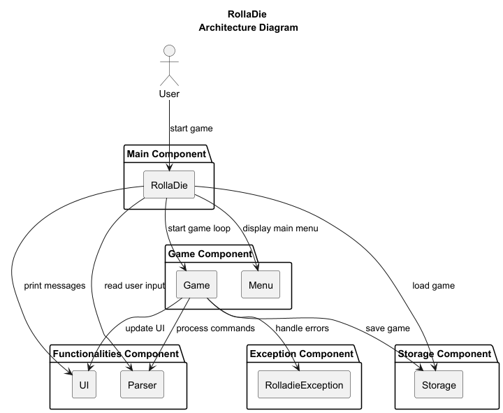
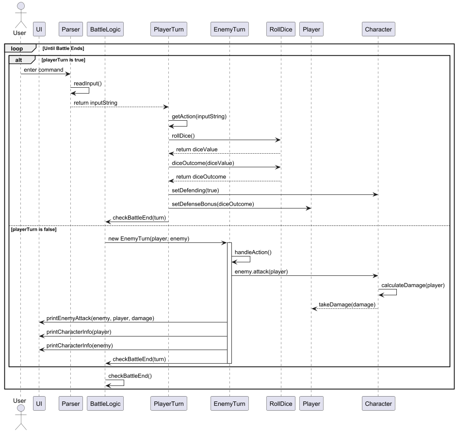

# RollaDie Developer Guide  

## Acknowledgement
This project was made possible with the help of the listed tools below:
- Junit (Provides a robust testing framework)
- Gradle (Simplifying dependency management and automating the build process)


## Setting Up and Getting Started    

Follow these steps to set up and run the game on your local machine.      

### Prerequisites 
Ensure you have the following installed:
- Intellij IDEA (highly recommended)
- Java 17 (Required to run the application)
- Gradle (Used for dependency management and building the project)

### Step 1: Fork and Clone the Repository       
1. **Fork** the repository to your GitHub account.
2. **Clone** the forked repository to your local machine using:
```
git clone https://github.com/AY2425S2-CS2113-T13-4/tp.git
```

### Step 2: Import the Project into IntelliJ IDEA
1. Open IntelliJ IDEA.
2. Click File > Open and select the cloned project folder.
3. When prompted, import the project as a Gradle project.
4. Wait for the dependencies to be downloaded.


## Design

## Architecture 
        

The Architecture diagram given above explain the high-level design of the application.      


### Class Structure
```
+---main
|   └── java
+---exceptions  
|   └── RolladieException.java  
|  
+---functionalities  
|   ├── Parser.java  
|   ├── Storage.java  
|   └── ui  
|       ├── UI.java  
|       ├── BattleUI.java  
|       ├── LootUI.java  
|       └── ShopUI.java  
|  
+---game  
|   ├── Game.java  
|   ├── Rolladie.java  
|   ├── RollDice.java  
|   ├── actions  
|   │   ├── Action.java  
|   │   ├── DefaultAction.java  
|   │   ├── ExitAction.java  
|   │   ├── HelpAction.java  
|   │   ├── StartAction.java  
|   │   ├── BattleAction (Attack, Defend, Flee)  
|   │   └── ShopAction (Buy, Sell, Leave)  
|   ├── characters (Player, Enemy, EnemyDatabase)  
|   ├── currency (Gold)  
|   ├── equipment (Armor, Boots, Weapons, Databases)  
|   ├── events  
|   │   ├── Event.java  
|   │   ├── Battle (Battle, BattleLogic, Turns)  
|   │   ├── Loot (Loot)  
|   │   └── Shop (Shop)  
|   └── menu (Menu, MenuSystem, TerminalUtils)  
└── seedu

```

## Component Details {To be Updated}

### 1. Main component
Main (consisting of classes `RollaDie`) is in charge of the app launch and shut down.     
- At app launch, it initializes the other components in the proper sequence and establishes their connections.       
- At shut down, it deactivates the other components and invokes cleanup methods as needed.  

The bulk of the app’s work is done by the following components:
- `functionalities`: Designed for enhancing user interactions such as reading and printing messages to and from terminal.
- `game`: Manipulate major gameplay mechanics.
- `Storage`: Manages saving and loading data to and from the hard disk.        
- `Exception`: Handle exceptions.

### 2. Functionalities component     
{To be updated}       
### 3. Game component       
{To be updated}       

### 4. Storage component
The Storage Component is responsible for saving and loading game progress.
It reads and writes game data to a text file (savefile.txt),
ensuring that players can resume their game after closing the application.         

The Storage class includes the following functionalities:
1. Save the game:

- The `saveGame(Player, Event, Queue<Event>)` method writes player stats, the current event,
and upcoming events to a file.    
- It converts game objects into a text format using their `toText()` methods.

2. Load the game:

- The `loadGame()` method reads the save file and reconstructs the game state.
- It calls helper methods `parseCharacterFromText()` and `parseEventFromText()` to convert text data back into objects.
- If the save file is missing or corrupted, it creates a new game instance.

3. Data Parsing:

- `parseCharacterFromText()` deciphers character stats (health, attack, defense, etc.) from text.
- `parseEventFromText()` reconstructs different game events, such as battles, from saved data.


### 5. Exception component
- Includes helper classes that support other components.
- exceptions: Contains `RolladieException.java` for handling custom errors.
- Parsers & Helpers: Includes Parser.java for reading user input.


  
## Implementation
## Key Features

### 1. Attack       
**Overview**    
        
The Attack Feature in RollaDie is a core component of the game's battle system, 
allowing the player and enemy to take turns attacking each other. The feature manages input handling, 
attack calculations, and battle progression.      
- During the player's turn, the game reads the player's command, 
determines the action, and roll dice to calculate attack bonuses. If the player chooses to attack, 
the attack is executed, and damage is applied to the enemy. The game then prints the attack message 
and checks if the battle has ended.      
- During the enemy's turn, the enemy follows a similar process—attacking the player, applying damage, 
and displaying attack messages. The game continues alternating between player and 
enemy turns until either the player or the enemy is defeated. This feature ensures smooth battle flow,
handles attack mechanics, and updates battle status dynamically, keeping the combat engaging and strategic.


**Implementation Details**     
        
The Attack Feature in RollaDie handles the player's and enemy's turn-based combat interactions. 
1. The process begins with the player's turn, where the user enters a command,
which is read and parsed by the Parser class.  
2. The parsed command is processed by PlayerTurn, which roll dice (RollDice) to determine any attack bonuses.       
3. The player’s attack is then executed by calling the attack() method in the **Character class**, 
which calculates the damage and applies it to the enemy.
4. After the attack, the UI displays the attack message, and BattleLogic checks if the battle has ended.    
5. If it's the enemy's turn, BattleLogic creates an **EnemyTurn** object, which handles the enemy's actions.
6. The enemy attacks the player using the attack() method in Character, similar to the player's attack.
7. The damage is calculated and applied to the player, followed by displaying the attack message and updating character info via UI.
The turn ends with BattleLogic checking if the battle should continue.
8. This loop repeats until the battle ends.

**Sequence Diagram**         
     
The sequence diagram below illustrates the process that occurs when the player inputs an attack command.


### 2. Defend        
**Overview**

The Defend Feature in RollaDie allows players to adopt a defensive stance during their turn instead of attacking.
This feature enhances strategic gameplay by giving the player an option to reduce incoming damage
rather than dealing damage. When the player chooses to defend, dice is rolled to determine a defense bonus,
which is applied to increase the player's resistance against enemy attacks.
The battle sequence continues until either the player or the enemy is defeated.

**Implementation Details**   

During the player’s turn:
1. The user inputs a command, which is processed by the **Parser class**
to determine the action and returns it to **PlayerTurn**.
2. **PlayerTurn** process the input using getAction(inputString)
3. If the player chooses to defend, **PlayerTurn** calls rollDice()
in the **RollDice** class to determine the defense bonus. 
4. **PlayerTurn** sets the player's defending state by calling setDefending(true) in the **Character** class and applies
   the defense bonus using setDefenseBonus(diceOutcome) in the **Player** class.
5. The game then checks if the battle has ended by calling checkBattleEnd(turn) in **BattleLogic**.

During the enemy’s turn:
1. **BattleLogic** creates a new **EnemyTurn** object.
2. The enemy executes its attack on the player.
3. The **Character** class calculates the damage using calculateDamage(player).
4. The damage calculation takes the player's defense into account,
reducing the damage if the player is in a defensive stance.
5. The **Player** takes damage using takeDamage(damage).
6. **EnemyTurn** calls printEnemyAttack(enemy, player, damage) in the **UI** class to display attack messages.
7. The **UI** updates character info by calling printCharacterInfo(player) and printCharacterInfo(enemy).
8. **EnemyTurn** checks if the battle has ended by calling checkBattleEnd(turn) in **BattleLogic**.


**Sequence Diagram**        

The sequence diagram below illustrates the process that occurs when the player inputs an defend command.




### 3. Flee        
{To be Updated}       
**Overview**      

**Implementation Details**          

**Sequence Diagram**          


### 4. Start      
{To be Updated}         
**Overview**

**Implementation Details**

**Sequence Diagram**


### 5. Load        
{To be Updated}          

**Overview**

**Implementation Details**

**Sequence Diagram**

### 6. Save       
{To be Updated}            
**Overview**

**Implementation Details**

**Sequence Diagram**


### 7. Shop
{To be Updated}       
**Overview**

**Implementation Details**

**Sequence Diagram**

### 8. Loot
{To be Updated}       
**Overview**

**Implementation Details**

**Sequence Diagram**


## Appendix

## Product scope

### Target user profile:

RollaDie is designed for CS2113 students who want a fun and simple way to relax, 
and to enjoy the easy-to-use text-based interface and clear game rules.
The game is also great for DnD fans who like turn-based battles, strategy, and storytelling,
without the hassle of setting up a full game.

### Value proposition:

RollaDie is a fun and nostalgic text-based RPG that brings the adventurous spirit of Dungeon & Dragons (DnD)
to life in a simple way.  It brings the excitement of classic role-playing games to a simple 
Command Line Interface (CLI), making it lightweight and easy to play anytime, anywhere.
Instead of dealing with complicated setups, players can jump straight into the action,
rolling dice, battling enemies, and making crucial choices.

## User Stories
***

| Version | As a ...        | I want to ...                                         | So that I can ...                   |
|---------|-----------------|-------------------------------------------------------|-------------------------------------|
| v1.0    | student player  | attack during the battle phase                        | deal damage to enemy.               | 
| v1.0    | student player  | defend during the battle phase                        | reduce the damage taken.            |
| v1.0    | student player  | fight enemies                                         | collect points for a final score.   |
| v1.0    | student player  | input simple commands ( attack, defend )              | get used to the controls.           |
| v1.0    | student player  | see my health bar                                     | better decide my next move.         |
| v2.0    | student player  | save game progress                                    | continue my game.                   |
| v2.0    | student player  | roll dice                                             | determine the outcome of an action. |
| v2.0    | student player  | fight different enemies with different battle effects | make the journey more dynamic.      |
| v2.0    | student player  | change my equipment                                   | determine the outcome of an action. |
| v2.0    | student player  | collect points                                        | upgrade my equipment.               |

## Non-Functional Requirements
1. Should work on any mainstream OS as long as it has Java 17 or above installed.
2. This game is designed as a single-player experience.
3. This game is optimized for users with an average typing speed.


## Testing        
{To be Updated}

### Structure
Tests are organized according to the package structure:

```
+---data
|   \---StorageTest
|           ValidData.txt
|           
\---java
+---game
|   |   GameTest.java
|   |   RolladieTest.java
|   |   RollDiceTest.java
|   |   
|   +---Battle
|   |       BattleTest.java
|   |       
|   +---Characters
|   |       CharacterTest.java
|   |       
|   \---functionalities
|           UITest.java
|           
\---seedu
\---duke

```


## Glossary
* *User* - A person who plays the game.
* *Mainstream OS* -  Windows, Linux, Unix, MacOS
