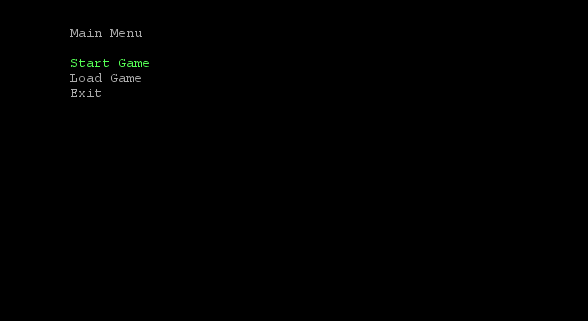

# RollaDie User Guide

## Table of content   
- [Introduction](#introduction-)
- [Quick Start](#quick-start-)
- [Features](#features-)
    - [1. Starting a new game](#1-starting-a-new-game-)
    - [2. Load previous game](#2-load-previous-game-)
    - [3. Attacking an enemy](#3-attacking-an-enemy)
    - [4. Defending against incoming attacks](#4-defending-against-incoming-attacks-)
    - [5. Surrender early](#5-surrender-early-)
    - [6. Buy equipment](#6-buy-equipment-)
    - [7. Sell equipment](#7-sell-equipment-)
    - [8. End shopping](#8-end-shopping-)
    - [9. Ending the game prematurely](#9-ending-the-game-prematurely-)
-[Command Summary](#command-summary)


## Introduction      

RollaDie is a Dungeon & Dragons (DnD) text-based RPG,
optimized to play using Command Line Interface (CLI) and has a simple text-ui display that reminisces games of the 1960s.
This program is meant for CS2113 students as a stress reliever, and it aims to provide a fun and replayable experience!


## Quick Start      

1. Ensure that you have Java 17 or above installed.
2. Down the latest version of `Rolladie` jar file from [here](https://github.com/AY2425S2-CS2113-T13-4/tp/releases/download/Release-V1.0/tp.jar).     
3. Run the jar file as follows:    
    - Put the jar file in a separate empty folder
    - Navigate to the jar file folder in a terminal
    - Run the jar file with the command: `java -jar "{file_name}"`

## Features   
> [!NOTE]            
> The dice outcome listed below are randomly generated, meaning the results will vary each time.         
> As a result, the damage dealt will also differ with each roll.

### 1. Starting a new game     
Initialise a new game instance.

- Press the run button in the top right corner to run the application.
- Use the `up`, `down` and `enter` key to select `start game`

Example outcome:



### 2. Load previous game  
Players can load previously saved game 
to continue their progress from where they left off.     

Command: `load`        
Example usage:
```
{To be updated}
```


### 3. Attacking an enemy
The player launches an attack on the enemy
with the damage dealt determined by the roll of a die.

Command: `attack`            
Example usage:  
```
attack
 _______ 
|       |
|   O   |
|       |
 ------- 

 _______ 
| O   O |
| O   O |
| O   O |
 ------- 

10 bonus points for this action!
Narrator: You punch the Goblin with your bare fist!
Narrator: You dealt 19 damage.
Narrator: The Goblin lunges forward and attacks!
Narrator: It dealt 13 damage.
Hero's stats:
HP: 	[#######################################################################################_____________]
ATK:	20
DEF:	10
Equipments: 
Goblin's stats:
HP: 	[###############################___________________]
ATK:	15
DEF:	5
```


### 4. Defending against incoming attacks   
Player defend themselves from incoming attacks and
gain defense bonus determined by a die roll.

Command: `defend`        
Example usage:
```
defend
 _______ 
| O   O |
| O   O |
| O   O |
 ------- 

 _______ 
| O     |
|   O   |
|     O |
 ------- 

10 bonus points for this action!
Narrator: The Goblin lunges forward and attacks!
Narrator: You barely felt that attack... the Goblin dealt only 9 damage.
Hero's stats:
HP: 	[##############################################################################______________________]
ATK:	10
DEF:	60
Equipments: 
Goblin's stats:
HP: 	[###############################___________________]
ATK:	15
DEF:	5
```

### 5. Surrender early    
Players can use the flee command to end the game early,
avoiding further damage but potentially losing reward.     

Command: `flee`       
Example usage:
```
{To be updated}
```

### 6. Buy equipment  
Players can use the buy command to purchase
weapons, armor, or boots from a shop using gold earned.        

Command: `buy`    
Example usage:
```
{To be updated}
```

### 7. Sell equipment     
Players can trade their unwanted gear for gold at a shop.       

Command: `sell`      
Example usage:
```
{To be updated}
```

### 8. End shopping    
Players can exit the shop and return to their adventure.      

Command: `leave`      
Example usage:
```
{To be updated}
```


### 9. Ending the game prematurely      
Players can quit the game early,
returning to the main menu or desktop.       

Command: `exit`       
Example usage:
```
{To be updated}
```


## Command Summary

* Load previous game: `load` {To be updated}       
* Attack an enemy `attack`
* Defend against attacks `defend` 
* Surrender early: `flee` {To be updated}     
* Buy equipment: `buy` {To be updated}     
* Sell equipment: `sell` {To be updated}     
* End shopping: `leave` {To be updated}        
* End game prematurely `exit` {To be updated}      

